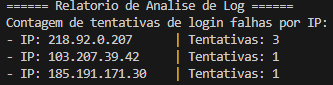

# 🔍 Analisador de Logs de Segurança em C++

Um programa em C++ que lê arquivos de log do sistema (como auth.log) e gera um relatório com a contagem de tentativas de login falhas por endereço de IP, ajudando a identificar potenciais ataques de força bruta.

## 📋 Funcionalidades

- Detecção Flexível: Utiliza expressões regulares para detectar uma ampla variedade de tentativas de login mal-sucedidas (ex: Failed password, invalid user, Authentication failure).

- Extração de IPs: Identifica e extrai endereços de IP (suportando IPv4 e IPv6) das linhas de log relevantes.

- Relatório Ordenado: Contabiliza as tentativas por IP e exibe um relatório claro com os endereços mais ativos ordenados de forma decrescente.

## 🚀 Como Executar

### 1. Clone o repositório

```bash
git clone https://github.com/GustavoKnocs/log-analyzer.git
cd log-analyzer
```

### 2. Compile o programa

```bash
g++ -o analisador analyzer.cpp -std=c++11
```

### 3. Execute

```bash
./analisador
```

> **Nota:** Por padrão, o programa lê o arquivo `auth.log` na mesma pasta. Se quiser, você pode editar o código para analisar outro arquivo de log.


## 🖥️ Demonstração

Abaixo, um exemplo da saída do programa ao analisar um arquivo de log de exemplo:



---

## 🔧 Tecnologias Utilizadas

-   C++
-   g++
-   Linux / WSL (Ubuntu)

## 📌 Sobre

*Projeto criado para estudo e prática de análise de logs em segurança da informação.*
